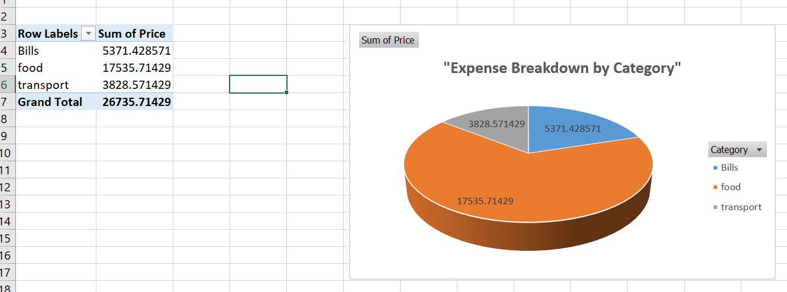

# Excel Expense Tracker

A personal expense tracking project built in Microsoft Excel to practice core data analysis skills.

## What it does
Tracks daily expenses across categories (Food, Transport, Bills) and payment modes (Cash, UPI), then summarizes spending using formulas, a pivot table, and a chart.

## Skills demonstrated
- Data cleaning (fixing date formats, removing inconsistent text entries)
- Excel formulas: SUM, AVERAGE, COUNTIF, SUMIF, MAX
- Pivot Tables for category-wise spending summary
- Pie chart visualization of spending breakdown

## Files
- `Expense_Tracker.xlsx` — the full spreadsheet with data, formulas, pivot table, and chart

## Screenshot

